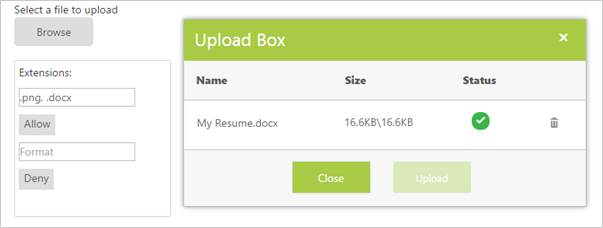

# Getting Started

## Create your first UploadBox in ASP.NET

ASP.NET Web Forms UploadBox provides support to upload the files or photos within your web page. From the following guidelines, you can learn how to upload the file by using Resume Upload scenario. This helps you to restrict some file extensions while uploading the resume in the server by using UploadBox control. The following screenshot demonstrates the functionality of UploadBox with file extension.

In the above screenshot, you can upload a resume with .png and .docx file extensions. This stops unsupported resume formats from being uploaded to the server.

### Create UploadBox widgets

ASP.NET UploadBox widget has built-in features like Upload multiple files, Delete files, check the status of the file, whether it shows complete or failed, and retry uploading the files.  You can easily create the UploadBox by using the following steps.

You can create a Web project and add the necessary assemblies, styles, and scripts with the help of the given [ASP-Getting Started](https://help.syncfusion.com/aspnet/getting-started) Documentation.

Add the following code example to the ASPX page to render the UploadBox.



    <b>Select a file to upload</b>

      

    <ej:UploadBox ID="Upload1" runat="server" SaveUrl="saveFiles.ashx" RemoveUrl="removeFiles.ashx" AutoUpload="false"></ej:UploadBox>



Add the given styles to show the UploadBox with margin alignments.



.upload

{

    margin-left: 20px;

    margin-top: 20px;

}        

.control

{

    margin-left: 15px;

}



Add the handlers to save and remove the files uploaded by using the UploadBox. Create a new handler file .ashx and save as 
saveFile.ashx and add the following code to it. 



public void ProcessRequest(HttpContext context)

{

    string targetFolder = HttpContext.Current.Server.MapPath("uploadfiles");

    if (!Directory.Exists(targetFolder))

    {

        Directory.CreateDirectory(targetFolder);

    }

    HttpRequest request = context.Request;

    HttpFileCollection uploadedFiles = context.Request.Files;

    if (uploadedFiles != null && uploadedFiles.Count > 0)

    {

        for (int i = 0; i < uploadedFiles.Count; i++)

        {

            if (uploadedFiles[i].FileName != null && uploadedFiles[i].FileName != "")

            {

                string fileName = uploadedFiles[i].FileName;

                int index = fileName.LastIndexOf("\\");

                if (index > -1)

                {

                    fileName = fileName.Substring(index + 1);

                }

                uploadedFiles[i].SaveAs(targetFolder + "\\" + fileName);

            }

        }

    }

}    



Create a new handler file .ashx and save as removeFile.ashx and add the following code to it. 



public void ProcessRequest(HttpContext context)

{

    System.Collections.Specialized.NameValueCollection s = context.Request.Params;

    string fileName = s["fileNames"];

    string targetFolder = HttpContext.Current.Server.MapPath("uploadfiles");

    if (Directory.Exists(targetFolder))

    {

        string physicalPath = targetFolder + "\\" + fileName;

        if (System.IO.File.Exists(physicalPath))

        {

            System.IO.File.Delete(physicalPath);

        }

    }     

}



Run the code to render the following output.

Run the project to see the following output for the given steps. The file is uploaded. 

## Set Restrictions to File Extensions

In a real-time scenario, some file extensions are restricted. You can allow files or restrict files by using the following properties, file allow and file deny enabled in the UploadBox. 

N> The SaveUrl and RemoveUrl are the same as above.

Add the following code example to the script section.



var object;

function allow()
{

    object = $("#<%=Upload1.ClientID%>").data("ejUploadbox");

    object.option('extensionsAllow', $("#Allow").val());

    object.option('extensionsDeny', "");

    $("#Deny").val(');

}

function deny() {

    object = $("#<%=Upload1.ClientID%>").data("ejUploadbox");

    object.option('extensionsAllow', "");

    object.option('extensionsDeny', $("#Deny").val());

    $("#Allow").val(');

}



Add input elements to create elements for file extensions.

N> Add the following input elements and two button elements to give file extensions that should support uploading.



    

        <b>Select a file to upload</b>

         

         

        <ej:UploadBox ID="Upload1" SaveUrl="saveFiles.ashx" RemoveUrl="removeFiles.ashx"

            ExtensionsAllow=".docx" ExtensionsDeny=".pdf" runat="server">

        </ej:UploadBox>

        <label id="extdetails">

            By default, it allow .docx format and deny .pdf format files

        </label>

    

     

     

    

        <b>Setting Restriction</b>

    

        

            

                Extensions:

            

        

        

            

                <input type="text" id="Allow" class="tb6 ejinputtext" />

            

            

                <ej:Button ID="upbutton1" Type="Button" CssClass="e-btn" Text="Allow" ClientSideOnClick="allow"

                    runat="server">

                </ej:Button>

            

        

        

            

                <input type="text" id="Deny" class="tb6 ejinputtext" />

            

            

                <ej:Button ID="upbutton2" Type="Button" CssClass="e-btn" Text="Deny" ClientSideOnClick="deny"

                    runat="server">

                </ej:Button>

            

        

    



Add the following Styles in the ASPX page to allow or deny files.


        
.upload

{

    margin-left: 20px;

    margin-top: 20px;

}

.control

{

    margin-left: 15px;

}

.ctrl

{

    border: 1px solid #ccc;

    border-radius: 10px;

    width: 150px;

    padding: 50px 100px 50px 100px;

    float: left;

}

.allow_deny

{

    border: 1px solid #ccc;

    border-radius: 10px;

    float: left;

    margin: 10px;

    padding: 15px;

}



Run the code to render the following output with the file extensions.

N> You can restrict one or more files at a time by giving it as .html,.txt.

In the UploadBox control, you can either allow files with specified extension only by using the ExtensionAllow property or deny files with specified extension only by using the ExtensionDeny property.

The following screenshot displays an UploadBox control with the file extension.

### Upload Multiple Files

To upload multiple files in the UploadBox control, click the Browse button to select files. The selected files appear in the UploadBox control and you can upload those files.

The following screenshot displays an UploadBox control with multiple files selected.

