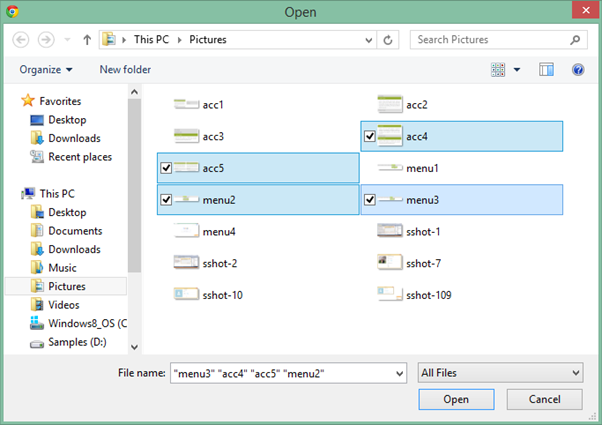

# Multiple Files Upload in ASP.NET Web Forms UploadBox

The UploadBox control provides support to upload multiple files spontaneously. The MultipleFilesSelection property enables you to select multiple files while browsing.  To achieve this, set the MultipleFilesSelection property to true. The data type is Boolean.

N> The Multiple file selection supports all the latest versions of browser except Internet Explorer 9 and its previous versions.

The following steps explain the configuration of the MultipleFilesSelection property in the UploadBox. 

In the ASPX page, add the UploadBox element.



<ej:UploadBox ID="Uploadbox" runat="server" SaveUrl="SaveFiles.ashx" RemoveUrl="RemoveFiles.ashx" MultipleFilesSelection="true" > </ej:UploadBox>



N> The SaveUrl and RemoveUrl are the same as above (see Save File Action and Remove File Action section).

The following screenshot displays the output.

