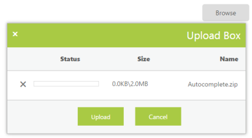

# RTL Support 

This feature supports the change of left-to-right alignment of the UploadBox control to right-to-left (RTL). That is, it sets the UploadBox to right-to-left actions.

The following steps explain the configuration of the EnableRTL property in the UploadBox. 

In the ASPX page, add the UploadBox element.



<ej:UploadBox ID="Uploadbox" runat="server" SaveUrl="SaveFiles.ashx" RemoveUrl="RemoveFiles.ashx" EnableRTL="true"></ej:UploadBox>



N> The SaveUrl and RemoveUrl are the same as above (see Save File Action and Remove File Action section).

The following screenshot displays the output for RTL support.

 

