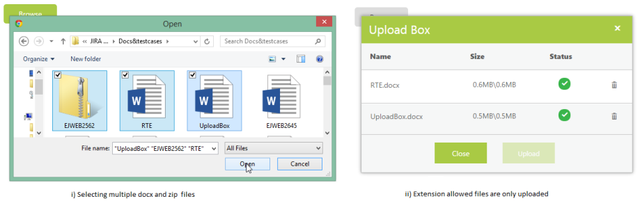
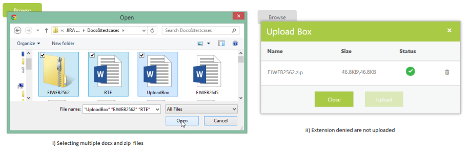

# Restricting uploading files based on its extension

## Allow Extension

Files are filtered before they are uploaded. You can select the files to be filtered by using the Browse button. 
The ExtensionAllow property allows upload of the selected extensions only. You can give multiple extensions by using comma (,).  The data type is string.

> Note: Prepend dot (.) symbol with extension like “.pdf”.

The following steps explain the configuration of the ExtensionAllow property in the UploadBox. 

In the ASPX page, add the UploadBox element.



<ej:UploadBox ID="UploadBox" runat="server" SaveUrl="SaveFiles.ashx" RemoveUrl="RemoveFiles.ashx" ExtensionsAllow=".docx,.pdf" MultipleFilesSelection="true"> 

</ej:UploadBox>



> Note: The SaveUrl and RemoveUrl are the same as above (see Save File Action and Remove File Action section).

The following screenshot displays the output when multiple files of different file types are selected and only the allowed file extensions are uploaded.

## Deny Extension

Files are filtered before they are uploaded. You can select the files to be filtered by using the Browse button. The ExtensionDeny property denies upload of the selected extensions. You can give multiple extensions by using comma (,).  The data type is string.

> Note: Prepend dot (.) symbol with extension like “.pdf”.

The following steps explain the configuration of the ExtensionDeny property in the UploadBox

In the ASPX page, add the UploadBox element.



<ej:UploadBox ID="UploadBox" runat="server" SaveUrl="SaveFiles.ashx" RemoveUrl="RemoveFiles.ashx" ExtensionsDeny=".docx,.pdf" MultipleFilesSelection="true">

</ej:UploadBox>



> Note: The SaveUrl and RemoveUrl are the same as above (see Save File Action and Remove File Action section).

The following screenshot displays the output when multiple files of different file types are selected and the denied file extensions are not uploaded.

