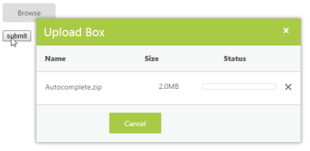

# Synchronous Upload 

This features allow you to upload and remove the files synchronously.When multiple files are chosen in Synchronous upload,all files will be uploaded only on form submission.Multitasking is not possible here.To achieve this, set the AsyncUpload property to false. The data type is Boolean.

N> By default, UploadBox control works with asynchronous upload option only.

The following steps guide you in uploading the file synchronously.

In the ASPX page, create a form with action and post method, then add the UploadBox element.



<form id="upload" method="post" runat="server" action="SaveFiles.ashx">

    

        <ej:UploadBox ID="Uploadbox" runat="server" AsyncUpload="false"> </ej:UploadBox>

    

    <input type="submit" value="submit" />

</form>



N> The SaveUrl and RemoveUrl are the same as above (see Save File Action and Remove File Action section).

The following screenshot displays the output.

 