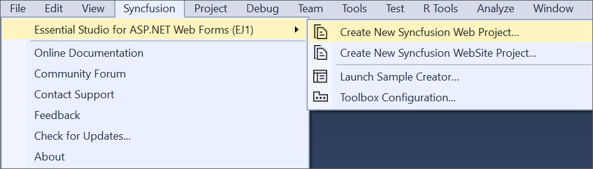
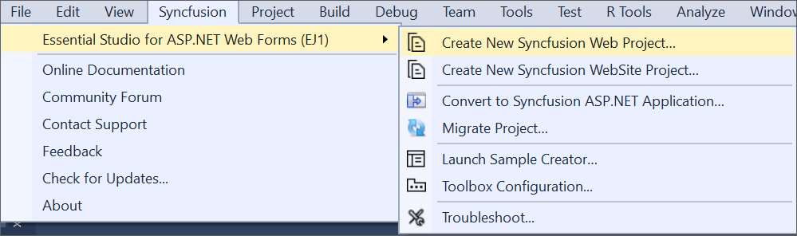
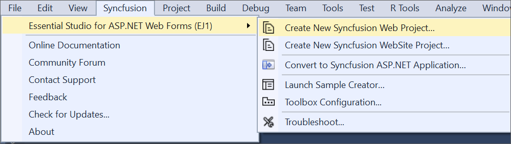

# Overview

The Syncfusion ASP.NET (Essential JS 1) Visual Studio Extensions can be accessed via the Syncfusion Menu to create and configure Visual Studio projects with Syncfusion references. Microsoft Visual Studio 2013 or higher is required to use the Syncfusion ASP.NET Extensions.

N> The Syncfusion Extension is now available in the Visual Studio Marketplace. ASP.NET Web Forms Extensions can be downloaded from [here](https://marketplace.visualstudio.com/items?itemName=SyncfusionInc.ASPNET-Web-Forms-Extensions).

I> The Syncfusion ASP.NET (Essential JS 1) menu option is available beginning with v17.1.0.32.

The Syncfusion ASP.NET extensions provide the following add-ins in Visual Studio:

1.	[Create Project](/aspnet/Visual-Studio-Integration/VS2019-Extensions/Create-Project): Creates the Syncfusion ASP.NET (Essential JS 1) Website or Web application by adding the necessary Syncfusion references, scripts, CSS, and Web.config entries.
2.	[Convert Project](/aspnet/Visual-Studio-Integration/VS2019-Extensions/Convert-Project): Converts an existing ASP.NET Website or Web application to the Syncfusion ASP.NET (Essential JS 1) Website or Web application by importing the necessary Syncfusion assemblies and resource files.
3.	[Upgrade Project](/aspnet/Visual-Studio-Integration/VS2019-Extensions/Upgrade-Project): Upgrades an existing Syncfusion ASP.NET Website or Web Application from one Essential Studio version to another.
4.	[Create Samples](/aspnet/Visual-Studio-Integration/VS2019-Extensions/Create-Samples): Creates the Syncfusion ASP.NET (Essential JS 1) Website or Web application with sample code for required components and features.
5.	[Troubleshooting](/aspnet/Visual-Studio-Integration/VS2019-Extensions/Troubleshooting): Troubleshoots the project with the Syncfusion configuration and applies the fix, such as a missing Framework Syncfusion assembly or a missing Syncfusion dependent assembly of a referred assembly.
6.	[Toolbox](/aspnet/Visual-Studio-Integration/Toolbox-Configuration): Configure the Syncfusion components into the Visual Studio .NET toolbox.

**No project selected in Visual Studio**

**Selected Microsoft ASP.NET WebSite or Web application in Visual Studio**

**Selected Syncfusion ASP.NET (Essential JS 1) WebSite or Web application in Visual Studio**

N> From Visual Studio 2019, Syncfusion menu is available under Extensions in Visual Studio menu.

