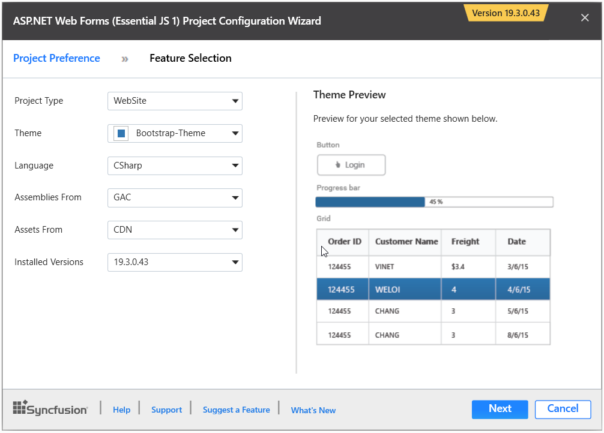
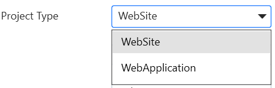
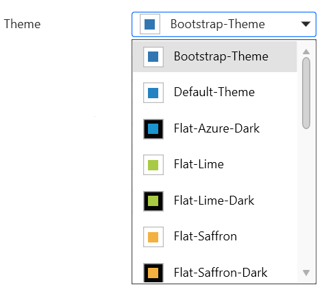
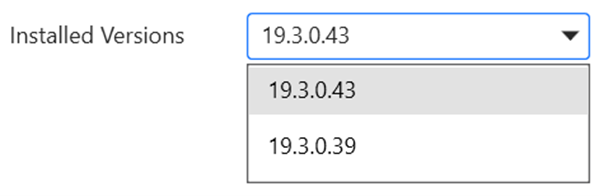
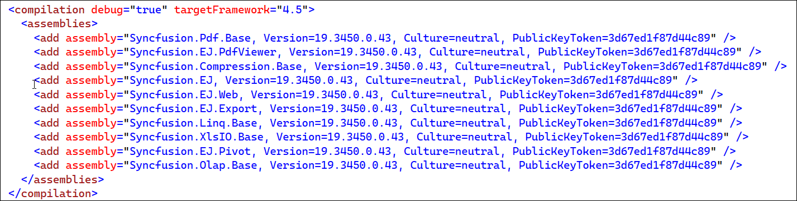

# Creating SyncfusionASP.NET Web Application

Syncfusion offers **Visual Studio Project Templates** for the Syncfusion ASP.NET platform, which can be used to create a Syncfusion ASP.NET Web Application or a Syncfusion ASP.NET Web Site.

I> Syncfusion ASP.NET Website templates are available beginning with v12.2.0.36, and Syncfusion ASP.NET Web Application templates are available beginning with v13.3.0.7. 

To create the **Syncfusion ASP.NET (Essential JS 1) Application** using the **Visual Studio Project Template**, follow the steps below:

> Before use the Syncfusion ASP.NET Web Forms Project Template, check whether the **ASP.NET Web Forms Extensions - Syncfusion** installed or not in Visual Studio Extension Manager by clicking on the Tools -> Extensions and Updates -> Installed for Visual Studio 2017 or lower and for Visual Studio 2019 by clicking on the Extensions -> Manage Extensions -> Installed.

1. To create a Syncfusion ASP.NET (Essential JS 1) Web Forms project, use one of the following methods:

   **Option 1**  
   Click **Syncfusion Menu** and choose **Essential Studio for ASP.NET Web Forms (EJ1) > Create New Syncfusion ASPNET Web Forms Project…** in **Visual Studio**.

   

   N> From Visual Studio 2019, Syncfusion menu is available under Extensions in Visual Studio menu.

   **Option 2**  
   Choose **File > New > Project** and navigate to **Syncfusion > Web > Syncfusion ASP.NET Web Forms Application** in **Visual Studio**.

   

2. Name the **project**, select the destination location, and configure the project's .NET Framework, then click **OK**. The Project Configuration Wizard is displayed. 

   N> The minimum target framework for Syncfusion ASP.NET Project Templates is 3.5.

3. Using the following Project Configuration window, select the options to configure the Syncfusion ASP.NET Web Forms Application.

   

**Project Configurations**

**Project Type:** Choose the appropriate Project Type either Website or WebApplication.

   

**Theme:** Choose the appropriate theme.

   

**Language:** Choose the language, either C# or VB.

   

**Assemblies From:** Choose the assembly location, from where the assembly will be added to the project.

   

**Assets From:** Choose the Syncfusion Essential JS assets to be added to the ASP.NET Web Forms Project from the NuGet, CDN, or Installed Location.

   

**Installed Version** Choose the version of the project that needs to be created.

   

4. Select the components, Assemblies, and Scripts that should be added to the project, and then click the Create button. The Syncfusion ASP.NET Web Forms project will be created.

   

   

5. The necessary Syncfusion Assembly references, Scripts, and CSS, as well as the necessary Web.config entries, have been added to the project.

   

   

   
   

6.Then, Syncfusion licensing registration required message box will be shown if you installed the trial setup or NuGet packages since Syncfusion introduced the licensing system from 2018 Volume 2 (v16.2.0.41) Essential Studio release. Navigate to the  [help topic](https://help.syncfusion.com/common/essential-studio/licensing/license-key#how-to-generate-syncfusion-license-key), which is shown in the licensing message box to generate and register the Syncfusion license key to your project. Refer to this [blog](https://blog.syncfusion.com/post/Whats-New-in-2018-Volume-2-Licensing-Changes-in-the-1620x-Version-of-Essential-Studio.aspx) post for understanding the licensing changes introduced in Essential Studio.

   

