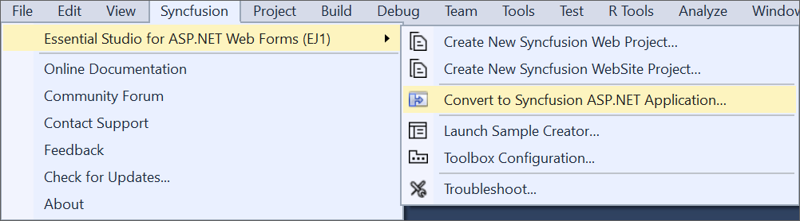
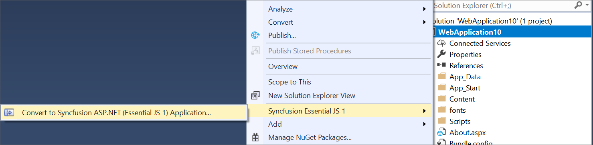
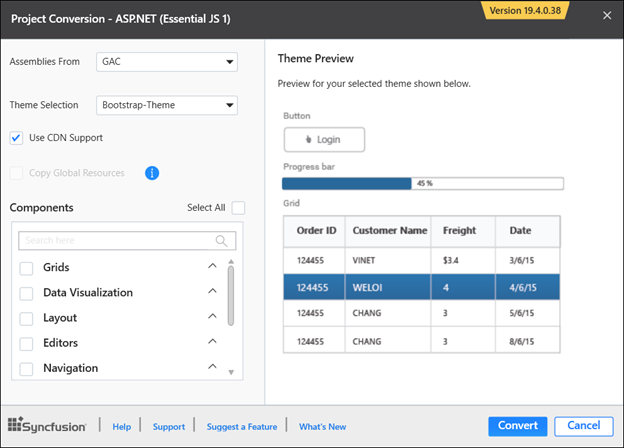
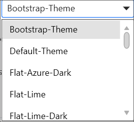
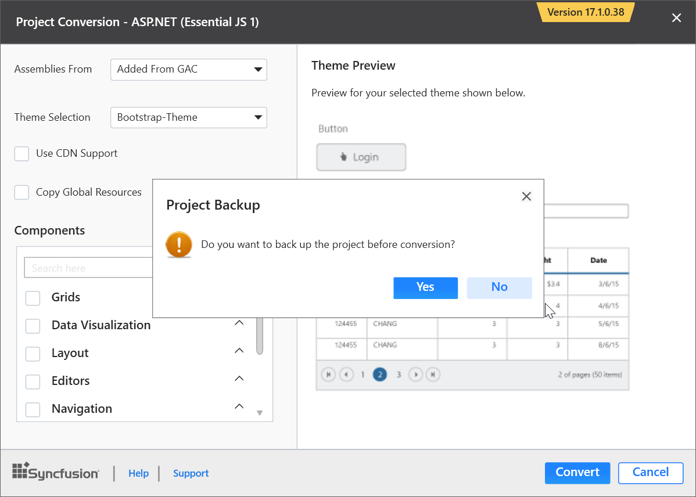
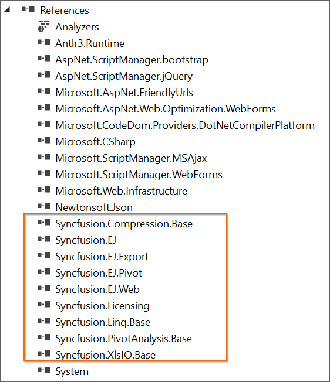
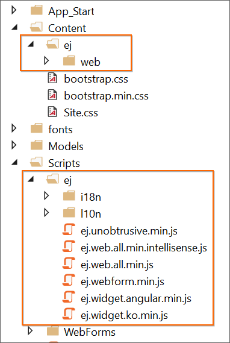

# Convert Project

Syncfusion project conversion is a Visual Studio add-in that converts an existing ASP.NET application into the Syncfusion ASP.NET (Essential JS 1) application by adding the required assemblies and resource files.

I> The Syncfusion ASP.NET Web Application Project Conversion utility is available from v13.1.0.30. 

The following steps help you use the Syncfusion Project conversion in the existing ASP.NET application:

1. Open an existing Microsoft ASP.NET Project or create a new Microsoft ASP.NET Project.

2. Open the conversion dialog by either one of the options below: 

   **Option 1**  
   Click **Syncfusion Menu** and choose **Essential Studio for ASP.NET Web Forms (EJ1) > Convert to Syncfusion ASP.NET Application…** in **Visual Studio**.

   

   N> In Visual Studio 2019, Syncfusion menu is available under Extensions in Visual Studio menu.

   **Option 2**   
   Right-click the Project from Solution Explorer, select **Syncfusion Essential JS 1**, and choose the **Convert to Syncfusion ASP.NET (Essential JS 1) Application...** Refer to the following screenshot for more information.

   

3. Project Conversion wizard opens to configure the project.

   

   The following configurations are used in the Project Conversion wizard:

   **Assemblies From:** Choose the assembly location, from where the assembly is added to the project.     
   
   
   
   **Choose the Theme:** The master page of project will be updated based on selected theme. The Theme Preview section shows the controls preview before convert into a Syncfusion project.
   
   

   **Choose CDN Support:** The master page of the project will be updated based on required Syncfusion CDN links.

   
 
   **Copy Global Resources:** If choose Copy Global Resources option, the Syncfusion localization culture files will be shipped to project from Installed Location. 

      

   N> Copy Global Resources option will disable when choose the CDN option.

   **Components:** Choose the required controls.

   

4. The **Project Backup** dialog will appear when **Click** the **Convert** button. In the dialog, if click **Yes**, it will backup the current project before converting into Syncfusion project. If click **No**, it will convert the project to Syncfusion project without backup.

   

5. The required Syncfusion Assembly references, Scripts, and CSS and required Web.config entries have been added to the project.

    

   

   

6. If you installed the trial setup or NuGet packages from nuget.org you have to register the Syncfusion license key to your project since Syncfusion introduced the licensing system from 2018 Volume 2 (v16.2.0.41) Essential Studio release. Navigate to the [help topic](https://help.syncfusion.com/common/essential-studio/licensing/license-key#how-to-generate-syncfusion-license-key) to generate and register the Syncfusion license key to your project. Refer to this [blog](https://blog.syncfusion.com/post/Whats-New-in-2018-Volume-2-Licensing-Changes-in-the-1620x-Version-of-Essential-Studio.aspx?_ga=2.11237684.1233358434.1587355730-230058891.1567654773) post for understanding the licensing changes introduced in Essential Studio.