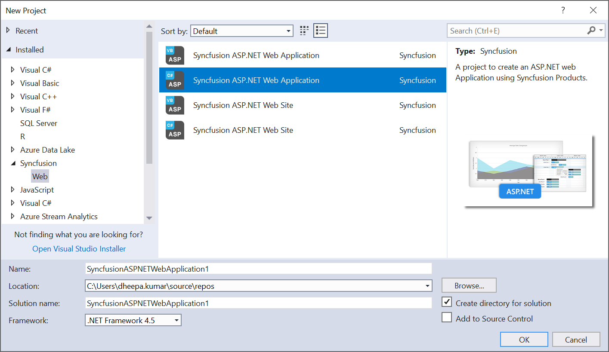
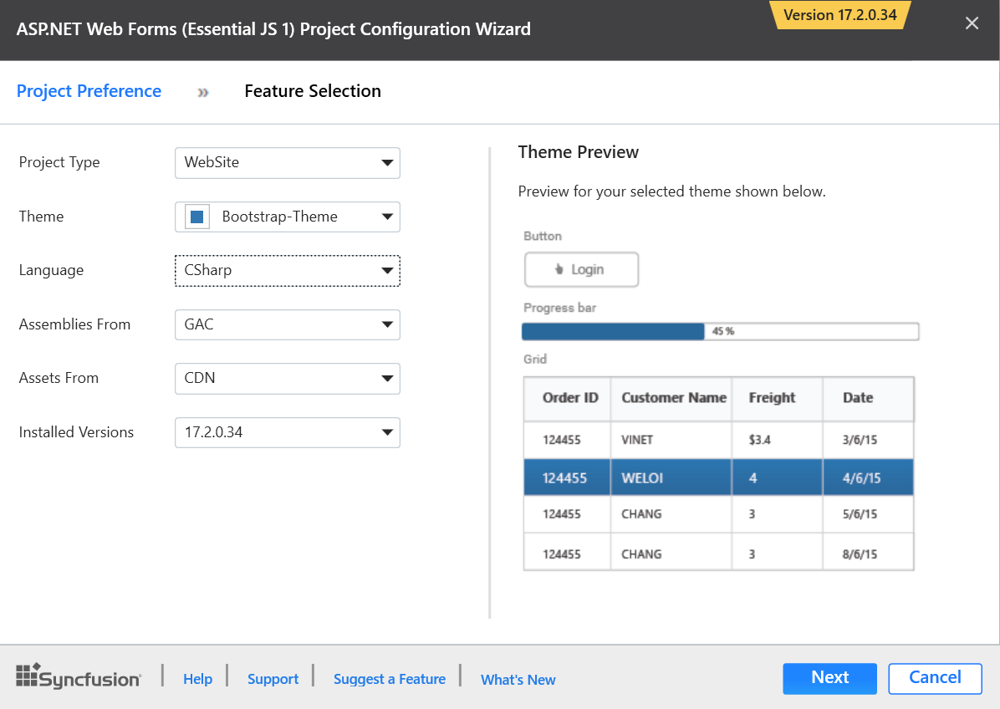
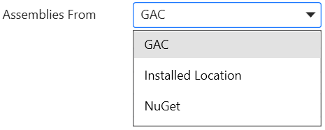
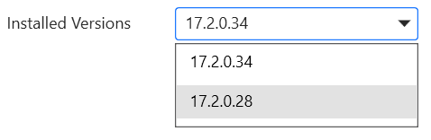
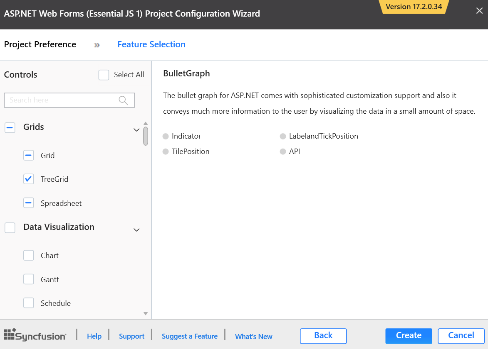
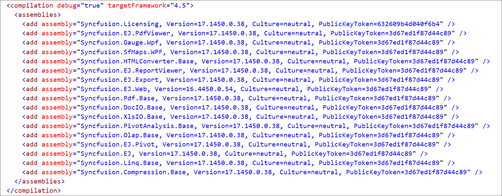

# Create Project

Syncfusion provides the **Visual** **Studio** **Project** **Templates** for the Syncfusion ASP.NET platform to create Syncfusion ASP.NET Web Application or Syncfusion ASP.NET Web Site. 

I> The Syncfusion ASP.NET Website templates are available from v12.2.0.36 and the Syncfusion ASP.NET Web Application templates are available from v13.3.0.7. 

Use the following steps to create the **Syncfusion ASP.NET (Essential JS 1) Application** through the **Visual Studio Project Template**:

1.To create a Syncfusion ASP.NET (Essential JS 1) Web Forms project, follow either one of the options below:

   **Option 1**  
   Click **Syncfusion Menu** and choose **Essential Studio for ASP.NET Web Forms (EJ1) > Create New Syncfusion ASPNET Web Forms Project…** in **Visual Studio**.

   

   N> In Visual Studio 2019, Syncfusion menu is available under Extensions in Visual Studio menu.

   **Option 2**  
   Choose **File > New > Project** and navigate to **Syncfusion > Web > Syncfusion ASP.NET Web Forms Application** in **Visual Studio**.

   

2.Name the **Project**, choose the destination location, and set the .NET Framework of the project, and then click **OK**. The Project Configuration Wizard appears.  

   N> Minimum target Framework is 3.5 for Syncfusion ASP.NET Project Templates.

3.Choose the options to configure the Syncfusion ASP.NET Web Forms Application by using the following Project Configuration window.

   

**Project Configurations**

**Project Type:** Choose the required Project Type either Website or WebApplication.

   

**Theme:** Choose the required theme.

   

**Language:** Select the language, either C# or VB.

   

**Assemblies From:** Choose the assembly location, from where the assembly is added to the project.

   

**Assets From:** Choose the Syncfusion Essential JS assets to ASP.NET Web Forms Project, either NuGet, CDN or Installed Location.

   

**Installed Version** Choose the version which version project need to created

   

4.Select the controls which Assemblies and Scripts need to be added to the project and click the create button then Syncfusion ASPNET Web Forms project created 

   

5.The required Syncfusion Assembly references, Scripts, and CSS and required Web.config entries have been added to the project.

   

   

   
   

6.Then, Syncfusion licensing registration required message box will be shown, if you installed the trial setup or NuGet packages since Syncfusion introduced the licensing system from 2018 Volume 2 (v16.2.0.41) Essential Studio release. Navigate to the  [help topic](https://help.syncfusion.com/common/essential-studio/licensing/license-key#how-to-generate-syncfusion-license-key), which is shown in the licensing message box to generate and register the Syncfusion license key to your project. Refer to this [blog](https://blog.syncfusion.com/post/Whats-New-in-2018-Volume-2-Licensing-Changes-in-the-1620x-Version-of-Essential-Studio.aspx) post for understanding the licensing changes introduced in Essential Studio.

   

