# Troubleshooting

Troubleshoot the project with the Syncfusion configuration and apply the fix like, wrong .NET Framework version of added Syncfusion assembly to the project or missing any Syncfusion dependent assembly of a referred assembly. The Syncfusion Troubleshooter can do the following:

* Report the Configuration issues.  

* Apply the solution

## Report the Configuration issues

The following steps help you to utilize the Syncfusion Troubleshooter by Visual Studio. 

1. To open Syncfusion Troubleshooter Wizard, follow either one of the options below: 
   
   **Option 1**  
   Open an existing Syncfusion ASP.NET Web Forms Application, Click **Syncfusion Menu** and choose **Essential Studio for ASP.NET Web Forms (EJ1) > Troubleshoot…** in Visual Studio.

   

   N> In Visual Studio 2019, Syncfusion menu is available under Extensions in Visual Studio menu.

   **Option 2**  
   Right-click the Project file in Solution Explorer, then select the command **Syncfusion Troubleshooter…**

   

2. Now, analyze the project and it will report the project configuration issues of Syncfusion controls in the Troubleshooter dialog if any issues found. If the project does not have any configuration issues, the dialog box will show there is no configuration changes required in following areas:

    * Syncfusion assembly references.

    * Syncfusion NuGet Packages. 

    * Syncfusion Web.config Entries.

    * Syncfusion Script files.

    * Toolbox Configuration.

   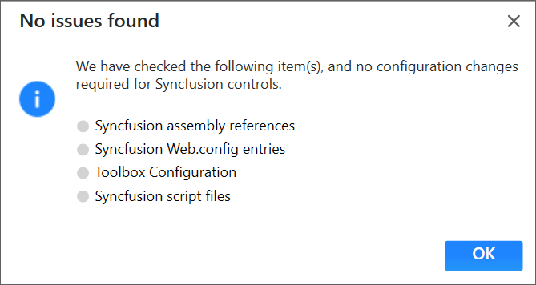

   I> The Syncfusion Troubleshooter command will be visible only for Syncfusion projects that means the project should contain Syncfusion assemblies or Syncfusion NuGet packages referred.

The Syncfusion Troubleshooter handles the following project configuration issues: 

1. Assembly reference issues.

2. NuGet related issues.

3. Web.config entries related issues.

4. Script file related issues.

5. Toolbox Configuration issues.

### Assembly reference issues

The Syncfusion Troubleshooter deals with the following assembly reference issues in Syncfusion Projects. 

1. Dependent assemblies are missing for referred assemblies from project. 

   **For Instance:**  If “Syncfusion.EJ.Pivot” assembly referred in project and “Syncfusion.PivotAnalysis.Base” and other dependent of Syncfusion.EJ.Pivot not referred in project, the Syncfusion Troubleshooter will show dependent assembly missing.

   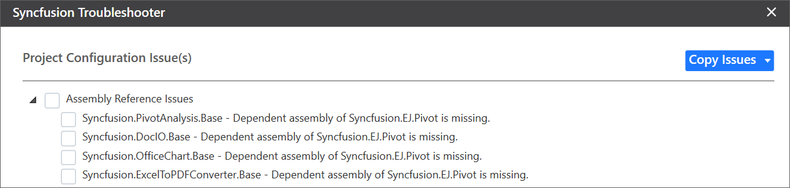

2. Syncfusion assembly version mismatched. Compare to all Syncfusion assembly’s versions in the same project. If found any Syncfusion assembly version inconsistency, the Syncfusion Troubleshooter will show Syncfusion assemblies version mismatched. 

   **For Instance:** If “Syncfusion.OfficeChart.Base” assembly (v15.2450.0.40) referred in project, but other Syncfusion assemblies referred assembly version is v15.2450.0.43. The Syncfusion Troubleshooter will show Syncfusion assembly version mismatched.

   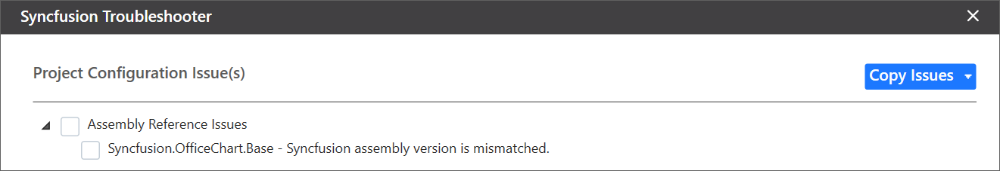

3. .NET Framework version mismatching (Syncfusion Assemblies) with project’s .NET Framework version. Find the supported .NET Framework details for Syncfusion assemblies in the following link,

   <https://help.syncfusion.com/common/essential-studio/supported-environments#net-framework> 

   **For Instance:** The.NET Framework of the application is v4.6 and “Syncfusion.EJ.PdfViewer” assembly (v16.4400.0.42 & .NET Framework version 4.0) referred in same application. The Syncfusion Troubleshooter will show Syncfusion assembly .NET Framework version is incompatible with project’s .NET Framework version.

   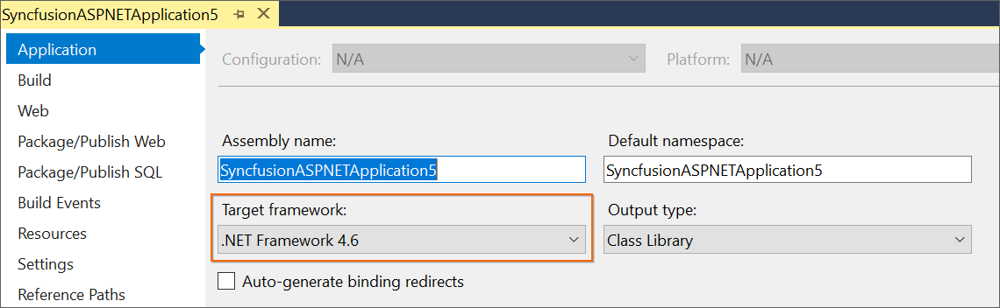

   

### NuGet issues

The Syncfusion Troubleshooter deals with the following NuGet package related issues in Syncfusion projects. 

1. Multiple versions of Syncfusion NuGet Packages are installed. If Syncfusion NuGet Package version is differed from other Syncfusion NuGet Package version, the Syncfusion Troubleshooter will show Syncfusion NuGet package version is mismatched. 

   **For Instance:** Syncfusion Web platform packages installed multiple version (v16.4.0.54 & v17.1.0.38), the Syncfusion Troubleshooter will show Syncfusion package version mismatched.
 
   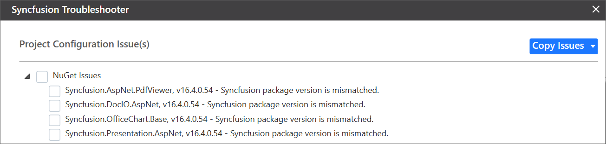

2. Dependent NuGet package of the installed Syncfusion NuGet packages is missing.

   **For Instance:** If install Syncfusion Web NuGet package alone in project (without dependency), the Syncfusion Troubleshooter will show the Syncfusion.Compression.Base and other dependent NuGet package missing.
 
   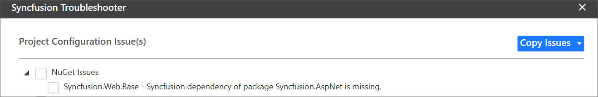

   I> Internet connection is required to restore the missing dependent packages. If internet is not available, the dependent packages will not be restored.

### Web.config issues

The Syncfusion Troubleshooter deals with the following Web.config entries related issues in Syncfusion projects. 

1. Syncfusion assembly entry version mismatched. Each Syncfusion assembly entry version/.NET Framework version will be compared with corresponding referred Syncfusion assembly in the application. 

   **For Instance:** If “Syncfusion.EJ.Pivot” assembly (v17.1450.0.38) referred in project, But “Syncfusion.EJ.Pivot” assembly entry version (v16.4450.0.54) in Web.config file. Syncfusion Troubleshooter will be shown Syncfusion assembly entry version mismatched.
 
   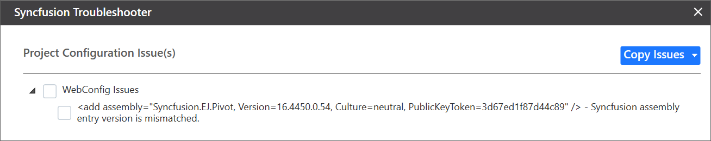

2. Multiple version and duplicate Syncfusion assembly entry. Syncfusion Troubleshooter will show the duplicate assembly entry when Syncfusion assembly entry is presented in Web.config, which is not referred in project or multiple Syncfusion assembly entry in Web.config for same Syncfusion assembly. 

   **For Instance:** If project have “Syncfusion.EJ.Web” assembly (v17.1450.0.38) entry in Web.config file, But “Syncfusion.EJ.Web” assembly not referred in project. Syncfusion Troubleshooter will be show Duplicate assembly entry.
 
   

   **For Instance:** If project Multiple “Syncfusion.EJ.Web” assembly (v16.4460.0.54 && v17.1460.0.38) entry with mismatched assembly version/.NET Framework version in Web.config, Syncfusion Troubleshooter will show the Duplicate assembly entry and Multiple Syncfusion assembly entries.

   

3. Namespace entry version mismatched. If any Namespace entry version (assembly version) mismatched with corresponding referred assembly version in ASP.NET Web Application, Syncfusion Troubleshooter will be shown Namespace entry version mismatched.

   **For Instance:** If “Syncfusion.EJ” assembly (v17.1450.0.38) referred in project and “Syncfusion.JavaScript.DataVisualization” Namespace entry version (v16.4450.0.54) in Web.config file. Syncfusion Troubleshooter will be show Syncfusion namespace entry version mismatched.
   
   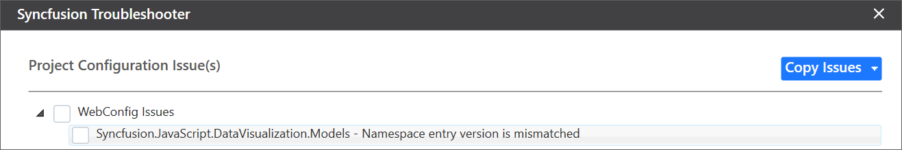

4. HTTP/Server handler entry mismatched. HTTP/Server handler entry version compare to corresponding referred assembly version in project, if any Syncfusion HTTP/Server handler entry version is mismatched, the Syncfusion Troubleshooter will show HTTP/Server handler entry mismatched.  

   **For Instance:** If “Syncfusion.EJ.” assembly (v17.1450.0.38) referred in project, But “Syncfusion.JavaScript.ImageHandler” HTTP/Server handler entry version (v16.4450.0.54) in Web.config file. Syncfusion Troubleshooter will be show Syncfusion HTTP/Server handler entry version mismatched.
   
   

### Toolbox Configuration Issues

The Syncfusion Troubleshooter deals with the following Toolbox Configuration related issues in Syncfusion projects. 

1. If the project .NET Framework version is not installed/configured Syncfusion Toolbox, the Syncfusion Troubleshooter will show Syncfusion Toolbox .NET Framework version is mismatched. 

   **For Instance:** The project .NET Framework version is 4.5 and Syncfusion Toolbox is not configured 4.6 framework assemblies only in corresponding Visual Studio, the Syncfusion Troubleshooter will show Syncfusion Toolbox framework version mismatched.
 
   

2. If Syncfusion Toolbox configured version is differed from latest Syncfusion assembly reference version or NuGet package version in same project, the Syncfusion Troubleshooter will show Syncfusion Toolbox version is mismatched.

   **For Instance:** If latest Syncfusion assembly reference version is v17.1.0.38 but Toolbox assemblies configured v17.1.0.32, the Syncfusion Troubleshooter will show Syncfusion Toolbox version mismatched.
  
   

### Script file issues

The Syncfusion Troubleshooter deals with the following Script file related issues in Syncfusion projects. 

1. Syncfusion script file version mismatched. Each Syncfusion script file version will be compared with corresponding referred Syncfusion assembly latest version in the application. 

   **For Instance:** If Syncfusion assemblies (v17.1450.0.38) referred in project and Syncfusion script file (v16.4.0.54) referred in project. The Syncfusion Troubleshooter will show Syncfusion script file version (v16.4.0.54) incompatible with the project of Syncfusion assembly’s/package version (v17.1.0.38).
 
   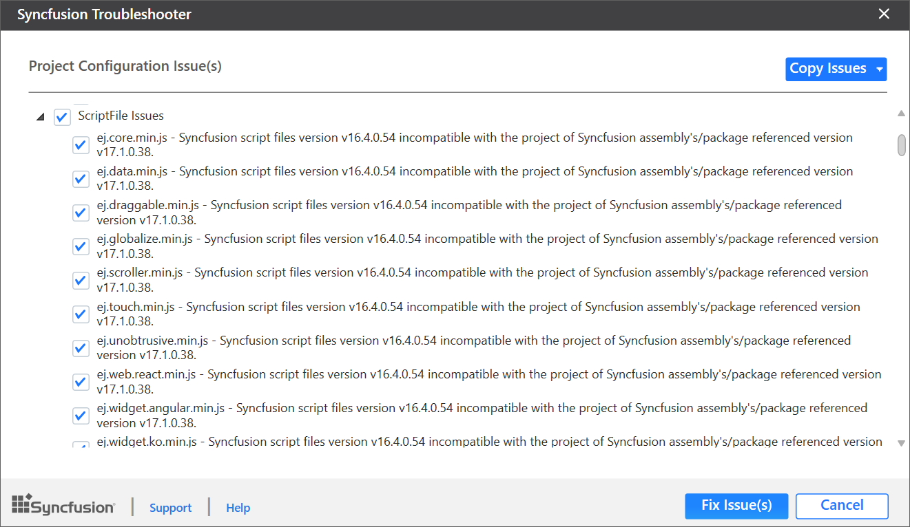

   **For Instance:** If Syncfusion assemblies (v17.1450.0.38) referred in project, but Syncfusion script file version (v16.4.0.54) in View files when referred script files by CDN link. The Syncfusion Troubleshooter will show Syncfusion script file version (v16.4.0.54) incompatible with the project of Syncfusion assembly’s/package version (v17.1.0.38) from CDN.

   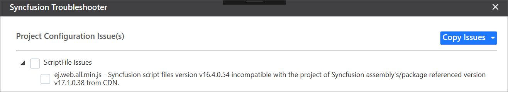

2. Duplicate Syncfusion script files. Syncfusion Troubleshooter will show the duplicate script files when Syncfusion script file presented in project location, which is referred in View files by CDN link or Syncfusion script files are presented in multiple location in same project.

   **For Instance:** If project have “ej.web.all.min.js” script file entry in View file and also “ej.web.all.min.js” script file available in project location (Scripts\ej), the Syncfusion Troubleshooter will show duplicate Syncfusion script files presented in \Scripts\ej, due to this script file referred from CDN.
  
   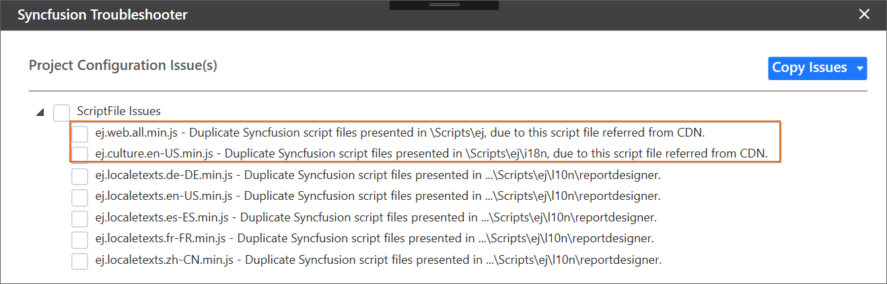

   **For Instance:** If project have “ej.web.all.min.js” script file available in multiple project location ("\Scripts\ej\" and "\Scripts\"), the Syncfusion Troubleshooter will show Duplicate Syncfusion script files presented in \Scripts.
  
   

## Apply the solution

1. After loading the Syncfusion Troubleshooter dialog, check the corresponding check box of the issue to be resolved. Then, click the “Fix Issue(s)” button. 

   

2. A dialog appears, which will ask to take a backup of the project before performing the troubleshooting process. If you need to backup the project before troubleshooting, click “Yes” button. 

   

3. Wait for a while, the Syncfusion Troubleshooter is resolving the selected issues. After the troubleshooting process completed, there will be a status message in the Visual Studio status bar as “Troubleshooting process completed successfully”.

   

4. Then, Syncfusion licensing registration required message box will be shown, if you installed the trial setup or NuGet packages since Syncfusion introduced the licensing system from 2018 Volume 2 (v16.2.0.41) Essential Studio release. Navigate to the  [help topic](https://help.syncfusion.com/common/essential-studio/licensing/license-key#how-to-generate-syncfusion-license-key), which is shown in the licensing message box to generate and register the Syncfusion license key to your project. Refer to this [blog](https://blog.syncfusion.com/post/Whats-New-in-2018-Volume-2-Licensing-Changes-in-the-1620x-Version-of-Essential-Studio.aspx) post for understanding the licensing changes introduced in Essential Studio.   

   