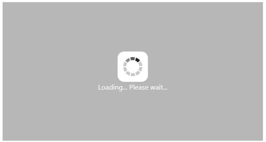
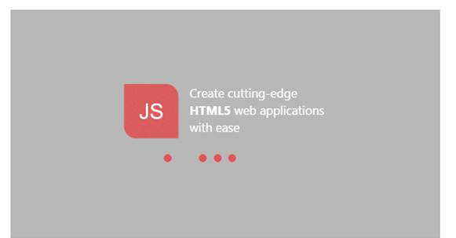
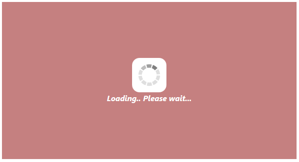

# Appearance and Styling 	

## Custom Text

There is support for Custom Text to mention any message in the pop-up panel.  You can specify a custom text via the option Text that is displayed when the Waiting Popup is loading.

The following steps explain the configuration of the custom text for WaitingPopup control.

Add the following code example to the corresponding ASPX page to render the WaitingPopup control with customized custom text.



<ej:WaitingPopup ID="target" runat="server" Target="#targetelement" ShowOnInit="True" Text="Loading... Please wait..."></ej:WaitingPopup>



Add the following styles to render the WaitingPopup control





The following screenshot displays the output for the above code.

  

## Template

Provides support for the template to customize the appearance of the WaitingPopup such as including HTML content instead of the default image.

The following steps explain how to define a template to display the text and image for WaitingPopup control.

Add the following code example to the corresponding ASPX page to render the WaitingPopup control with customized template.



<ej:WaitingPopup ID="target" runat="server" Target="#targetelement" ShowOnInit="True" Template="#content" CssClass="waiting"></ej:WaitingPopup>

    

        

        

            
Create cutting-edge 

            
<b>HTML5</b> web applications 

            
with ease 

        

    

    



In CSS, the custom styles need to be configured for the WaitingPopup.

N> Images for this sample are available at ‘installed location/Content/images’ and images are to be defined in the mentioned CSS. Then the images are displayed.





Run the above code for the following output.

 

N> Images for this sample are available in (installed location)\Syncfusion\Essential Studio\{{ site.releaseversion }}\Web\samples\web\content\images\waitingpopup 

## CSS Class

The CSS class can be used to customize the WaitingPopup control’s appearance. Define a CSS class as per the requirement and assign the class name to CssClass property.

The following steps allows you to configure CSS class for an auto-complete textbox.

Add the following code example to the corresponding ASPX page to render the WaitingPopup control on page load.



<ej:WaitingPopup ID="target" runat="server" Target="#targetelement" ShowOnInit="True" CssClass="custom" Text="Loading... Please wait..."></ej:WaitingPopup>



Define the CSS class for customizing the WaitingPopup control.





The following screenshot displays the output for the above code.

 

