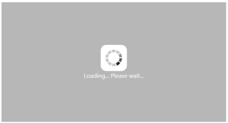
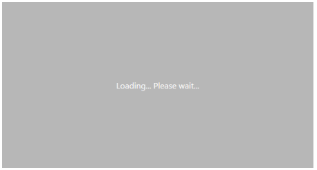

# Behavior and Settings

## Automatic Initializing WaitingPopup Control

WaitingPopup control provides the ShowOnInit property to allow the waiting popup to display over target on page load automatically. You can use the Target property to map the exact element to show the WaitingPopup. By default, showOnInit property is set to false.

The following steps explain how to display the WaitingPopup on page load.

Add the following code example to the corresponding ASPX page to render the WaitingPopup control on page load.



<ej:WaitingPopup ID="target" Target="#target" runat="server" ShowOnInit="True"></ej:WaitingPopup>



Add the following styles to render the WaitingPopup control





Output for the WaitingPopup when showOnInit is set to true.

## Enable or Disable Popup Indicator

You can show or hide the popup indicator of the WaitingPopup control by using the ShowImage property. By default, the ShowImage property is set to true.

The following steps explain how to enable or disable the popup indicator in the WaitingPopup control.

Add the following code example to the corresponding ASPX page to enable or disable the popup indicator in the WaitingPopup control.



Enable popup indicator:

<ej:WaitingPopup ID="target" runat="server" Target="#target" ShowOnInit="True" ShowImage="true" Text="Loading... Please wait..."></ej:WaitingPopup>

Disable popup indicator:

<ej:WaitingPopup ID="target1" runat="server" Target="#target1" ShowOnInit="True" ShowImage="false" Text="Loading... Please wait..."></ej:WaitingPopup>    



Add the following styles to render the WaitingPopup control.





The following screenshots display the enabled and disabled popup indicator WaitingPopup control.

 

 

## Show or Hide WaitingPopup

By using the show() or hide() method, you can display or hide the WaitingPopup control over the target area.

The following steps explain how to show or hide the WaitingPopup control.

Add the following code example to the corresponding ASPX page to show/hide the WaitingPopup control.



<ej:WaitingPopup ID="target" runat="server" Target="#target" ShowOnInit="True"></ej:WaitingPopup>



Show/Hide WaitingPopup as follows.



Show WaitingPopup:

Hide WaitingPopup:



Add the following styles to render the WaitingPopup control.





Output for WaitingPopup when invoking the show() method.

 

